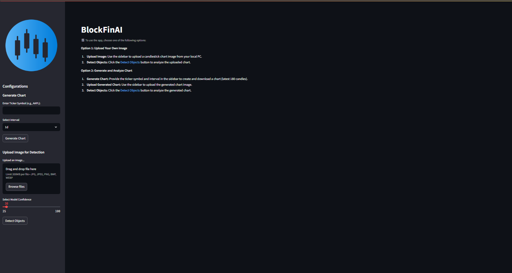
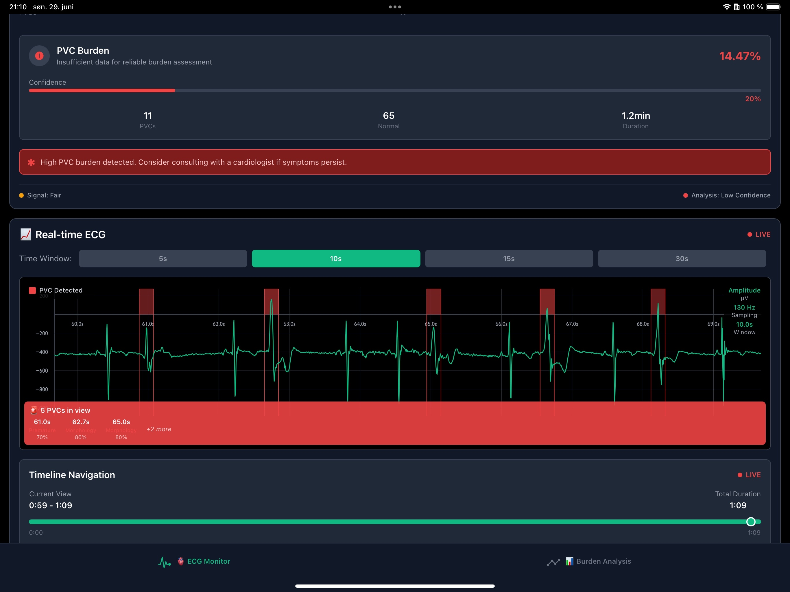
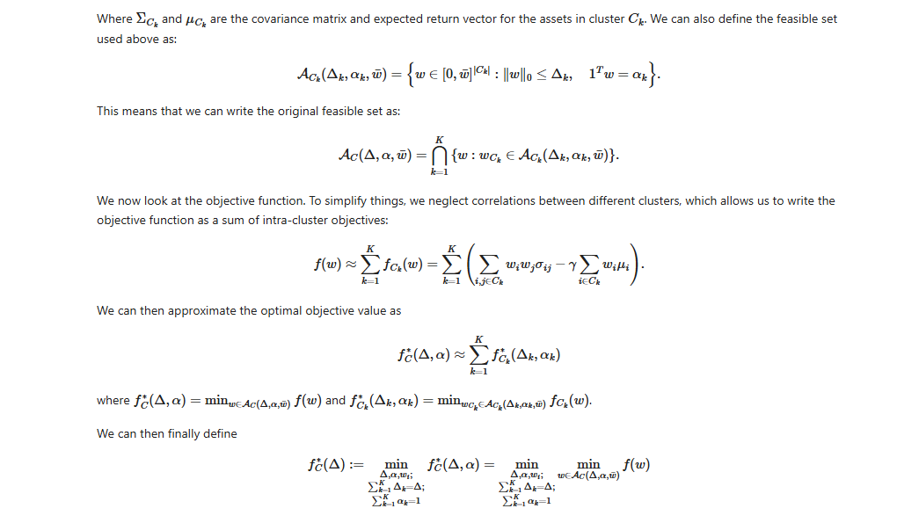
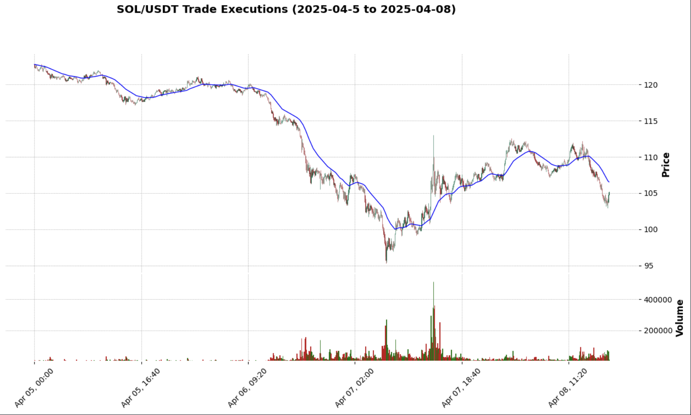
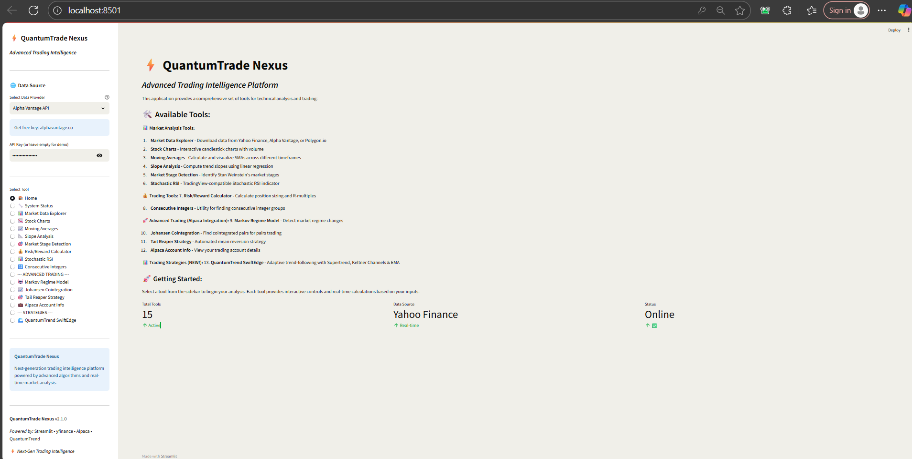

<div align="center">

# 🚀 VimalDev Portfolio

### *Quantitative Analyst | AI/ML Engineer | Data Scientist*

[](https://nextjs.org/)
[](https://www.typescriptlang.org/)
[](https://tailwindcss.com/)
[](https://react.dev/)

*A modern, responsive portfolio showcasing expertise in quantitative finance, algorithmic trading, and AI/ML engineering.*

[📧 Contact](mailto:vimaldhama0@gmail.com) • [💼 LinkedIn](https://linkedin.com/in/vimaldhama) • [🔗 GitHub](https://github.com/vimal0156)

</div>

---

## ✨ Features

🎨 **Modern Design System**
- Glassmorphic UI components with backdrop blur effects
- Smooth animations powered by Framer Motion
- Responsive design optimized for all devices
- Dark theme with custom color palette

🚀 **Performance Optimized**
- Server-side rendering with Next.js 15
- Optimized images and assets
- Fast page loads and smooth transitions
- SEO-friendly architecture

💼 **Professional Sections**
- Dynamic hero with animated gradients
- Interactive project showcase
- Skills visualization with marquee effects
- Work experience timeline
- Contact form with email integration

---

## 🖼️ Portfolio Showcase

<div align="center">

### Featured Projects

<table>
  <tr>
    <td align="center" width="33%">
      
      <br/>
      <b>AlgoStockGPT AI</b>
      <br/>
      <sub>AI-Powered Financial Intelligence</sub>
    </td>
    <td align="center" width="33%">
      
      <br/>
      <b>BlockFinAI</b>
      <br/>
      <sub>YOLOv8 Chart Pattern Detection</sub>
    </td>
    <td align="center" width="33%">
      
      <br/>
      <b>Ruaroa AI</b>
      <br/>
      <sub>Zero-Code ML Pipeline Generator</sub>
    </td>
  </tr>
  <tr>
    <td align="center" width="33%">
      
      <br/>
      <b>ECG Arrhythmia Detector</b>
      <br/>
      <sub>Real-time Cardiac Monitoring</sub>
    </td>
    <td align="center" width="33%">
      
      <br/>
      <b>Portfolio Selection</b>
      <br/>
      <sub>Cardinality-Constrained Optimization</sub>
    </td>
    <td align="center" width="33%">
      
      <br/>
      <b>SOLUSDT Signal Bot</b>
      <br/>
      <sub>Algorithmic Trading System</sub>
    </td>
  </tr>
  <tr>
    <td align="center" width="33%">
      
      <br/>
      <b>QuantumTrade Nexus</b>
      <br/>
      <sub>Advanced Trading Intelligence Platform</sub>
    </td>
  </tr>
</table>

</div>

---

## 🛠️ Tech Stack

### **Frontend**
```
Next.js 15  •  React 19  •  TypeScript  •  TailwindCSS
Framer Motion  •  Radix UI  •  shadcn/ui
```

### **Backend & APIs**
```
Next.js API Routes  •  Nodemailer  •  Supabase
```

### **Development Tools**
```
Git  •  npm  •  PostCSS  •  ESLint
```

### **Key Libraries**
- **UI Components**: Radix UI primitives with shadcn/ui
- **Animations**: Framer Motion for smooth transitions
- **Forms**: React Hook Form with Zod validation
- **Styling**: TailwindCSS with custom design tokens
- **Icons**: Lucide React
- **Notifications**: Sonner for toast messages

---

## 🚀 Getting Started

### Prerequisites

```bash
Node.js 18.0 or higher
npm or pnpm package manager
```

### Installation

1. **Clone the repository**
```bash
git clone https://github.com/vimal0156/portfolio.git
cd portfolio
```

2. **Install dependencies**
```bash
npm install --legacy-peer-deps
# or
pnpm install
```

3. **Set up environment variables**
```bash
# Create .env.local file
EMAIL_USER=your-email@gmail.com
EMAIL_PASS=your-app-password
```

4. **Run the development server**
```bash
npm run dev
# or
pnpm dev
```

5. **Open your browser**
```
Navigate to http://localhost:3000
```

---

## 📁 Project Structure

```
portfolio/
├── app/                          # Next.js app directory
│   ├── api/                      # API routes
│   │   ├── contact/             # Contact form endpoint
│   │   └── admin/               # Admin authentication
│   ├── admin/                    # Admin dashboard
│   ├── learn/                    # Learning platform
│   ├── layout.tsx               # Root layout
│   ├── page.tsx                 # Home page
│   └── globals.css              # Global styles
│
├── components/                   # React components
│   ├── ui/                      # shadcn/ui components
│   ├── magicui/                 # Custom UI components
│   ├── contact-form.tsx         # Contact form
│   ├── ECGProjectCard.tsx       # Special project card
│   ├── floating-nav.tsx         # Navigation bar
│   ├── project-card.tsx         # Project showcase
│   ├── timeline.tsx             # Experience timeline
│   └── ...                      # Other components
│
├── hooks/                        # Custom React hooks
├── lib/                          # Utility functions
├── public/                       # Static assets
│   ├── AlgoStockGPT AI.png      # Project screenshots
│   ├── BlockFinAI.png
│   ├── Ruaroa AI.png
│   ├── p4.png
│   ├── portfolio.png
│   ├── trade.png
│   ├── VIMALRESUME.pdf          # Resume file
│   └── ...
│
└── Configuration files
    ├── next.config.mjs          # Next.js config
    ├── tailwind.config.ts       # Tailwind config
    ├── tsconfig.json            # TypeScript config
    └── package.json             # Dependencies
```

---

## 🎨 Key Features Breakdown

### 🏠 Hero Section
- Animated gradient background
- Dynamic text effects
- Call-to-action buttons
- Social media links

### 💼 Projects Section
- Grid layout with hover effects
- Project cards with images and descriptions
- Technology tags
- GitHub repository links
- Live demo links

### 🎯 Skills Section
- Animated marquee display
- Skill badges with proficiency levels
- Responsive layout for mobile and desktop

### 📊 Experience Timeline
- Chronological work history
- Company details and descriptions
- Animated scroll effects

### 📧 Contact Form
- Form validation with Zod
- Email integration with Nodemailer
- Toast notifications
- Responsive design

---

## 🔧 Configuration

### Email Setup (Contact Form)

1. Enable 2-factor authentication on your Gmail account
2. Generate an app-specific password
3. Add credentials to `.env.local`:

```env
EMAIL_USER=your-email@gmail.com
EMAIL_PASS=your-16-digit-app-password
```

### Customization

**Update Personal Information:**
- Edit `app/page.tsx` for content
- Replace images in `public/` folder
- Update `VIMALRESUME.pdf` with your resume
- Modify `app/layout.tsx` for meta tags

**Styling:**
- Colors: `tailwind.config.ts`
- Global styles: `app/globals.css`
- Component styles: Individual component files

---

## 📦 Build & Deploy

### Production Build

```bash
npm run build
npm start
```

### Deploy to Vercel

[](https://vercel.com/new/clone?repository-url=https://github.com/vimal0156/portfolio)

1. Push your code to GitHub
2. Import project to Vercel
3. Add environment variables
4. Deploy!

---

## 🎯 Performance

- ⚡ **Lighthouse Score**: 95+ across all metrics
- 🚀 **First Contentful Paint**: < 1.5s
- 📱 **Mobile Optimized**: Fully responsive
- ♿ **Accessibility**: WCAG 2.1 compliant

---

## 📄 License

This project is open source and available under the [MIT License](LICENSE).

---

## 🤝 Connect With Me

<div align="center">

[](https://linkedin.com/in/vimaldhama)
[](https://github.com/vimal0156)
[](mailto:vimaldhama0@gmail.com)

### 💡 *"Engineering solutions that are both mathematically sound and practically impactful."*

</div>

---

<div align="center">

**Built with ❤️ by Vimal Dhama**

*Quantitative Analyst | AI/ML Engineer | Data Scientist*

⭐ Star this repo if you find it helpful!

</div>